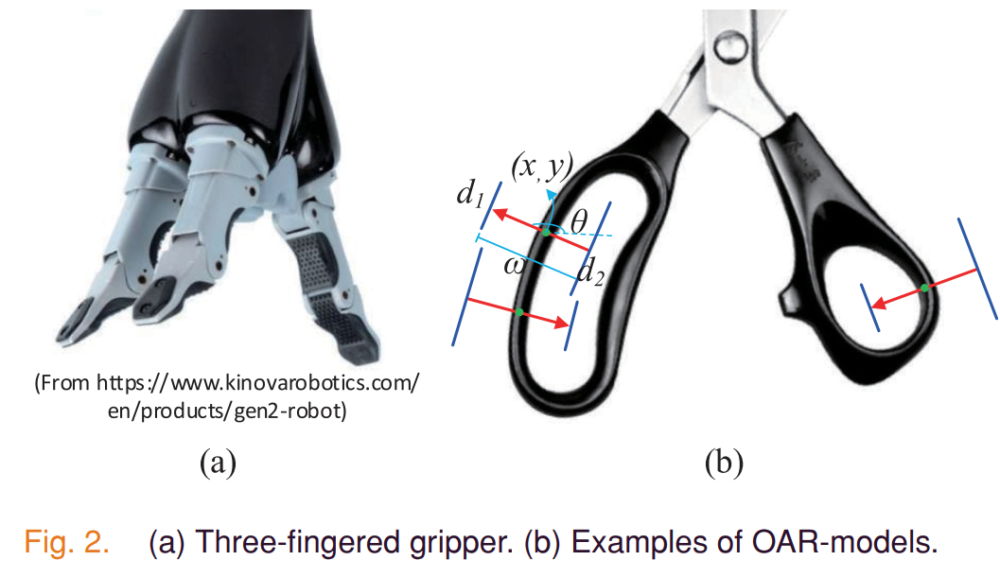
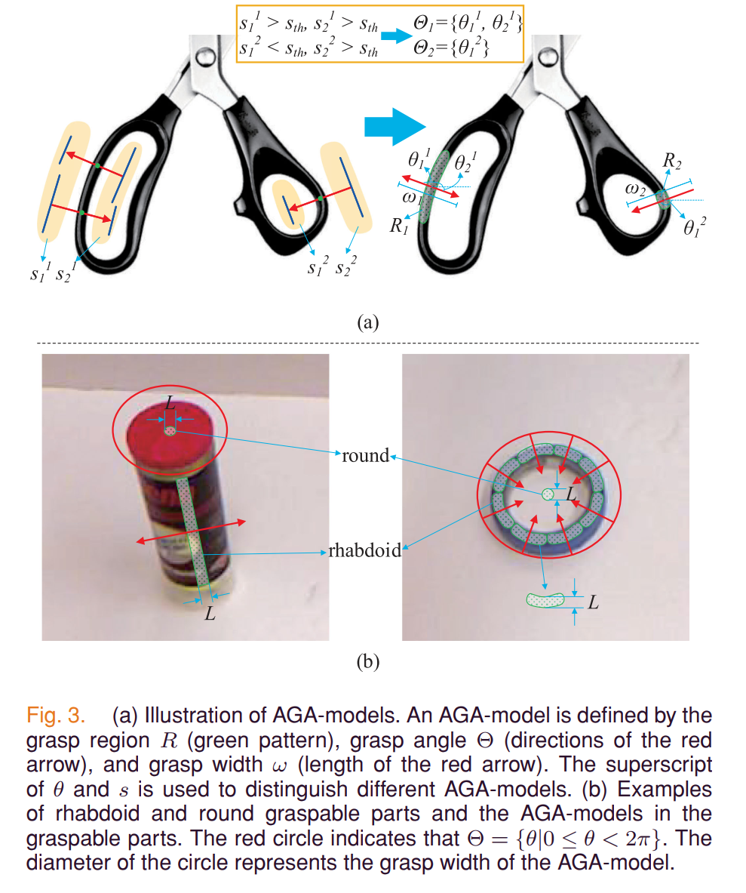
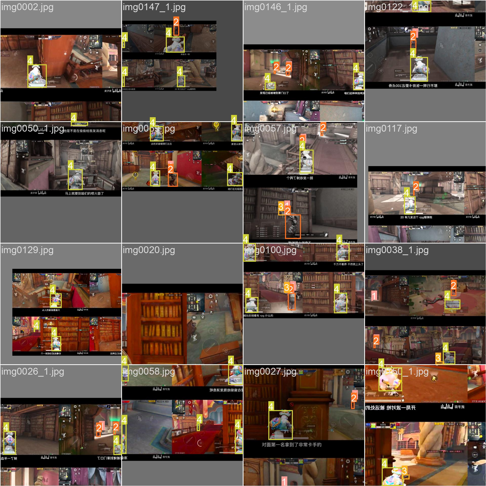
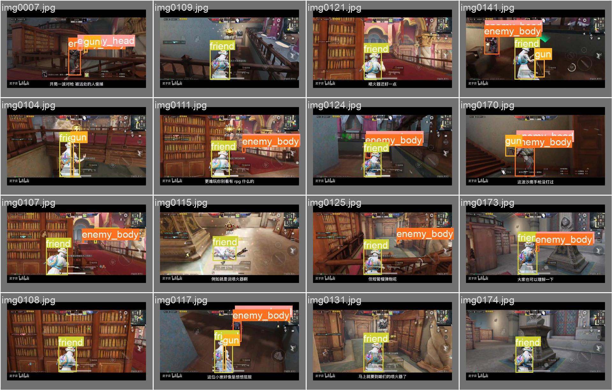

# 第二次汇报

汇报日期：2022-11-29

## 论文阅读

[High-Performance Pixel-Level Grasp Detection Based on Adaptive Grasping and Grasp-Aware Network](https://ieeexplore.ieee.org/document/9586564)

论文有开源代码：https://github.com/liuchunsense/AFFGA-Net

主要提出了三个东西：

- Oriented Arrow Representation Model (OAR-model)

- Adaptive Grasping Attribute Model (AGA-model)

- Adaptive Feature Fusion and Grasp-Aware Network (AFFGANet)

基于 OAR-model 和 AGA-model 就可以将抓取检测的问题转换为像素级分割问题。然后文章基于 deeplabv3+ ，提出了下面四个方法：

- hybrid atrous spatial pyramid (HASP),
-  adaptive decoder (AD),
-  mixed upsampling,
-  sigmoid  

resnet101 做 backbone，decoder接了三个输出分别是

- Region head  输出每个像素点位于抓取区域 r 的置信度
- Angle head  输出每个点对应的抓取角的k类
- Width head  输出与每个点对应的抓取宽度

[Real-Time Grasp Detection Using ConvolutionalNeural Networks](http://arxiv.org/abs/1412.3128)

yolo 作者的文章，看起来像 yolo 的前身。也是对图像划分为NxN的网格，然后对每个网格直接回归出抓取矩形的 5 个参数 {x,y,θ,h,w} 和一个目标种类的输出。

**两个文章都是基于 cornell 数据集做实验。**

https://github.com/skumra/robotic-grasping

## 实践

### YOLO

源代码来自：https://github.com/ultralytics/yolov5，这个代码基于 pytorch 实现的 yolov5 。

- 跑了不同网络大小的 yolov5 训练好的权重参数的效果
- 用 labelme 软件自己标注了300张目标检测的图片制作数据集
- 改进了 GitHub 上的一个[转换工具](https://github.com/TDA-2030/HNU-learning/blob/master/tools/labelme_json2txt.py)，这个工具用于将 labelme 生成的 json 格式转换到 yolo 需要的 txt 格式
- 基于上面的数据集训练 yolov5，然后测试效果
- 研究了一下 yolov5 的代码和 yolov1 的主要作者 [Joseph Redmon](https://arxiv.org/search/cs?searchtype=author&query=Redmon%2C+J) 。代码结构的设计值得借鉴，还没怎么看懂

### 自己的NN

https://github.com/TDA-2030/HNU-learning/tree/master/my_experiment/best_practice

### 模型部署

| 推理框架    | 维护方      | 应用场景            |
| ----------- | ----------- | ------------------- |
| onnxruntime | MS          | 比较通用            |
| TensorRT    | Nvidia      | 有 NV GPU 的情况    |
| OpenVIVO    | Intel       | 有 Intel 平台的情况 |
| Tengine     | OPEN AI LAB | 边缘设备            |
| ncnn        | Tencent     | 移动端              |
| mnn         | Alibaba     | 移动端              |
| tflite      | Google      | 移动端              |

尝试把 MNN 框架交叉编译运行到树莓派，运行库找不到的问题还没有解决，树莓派太弱了，自己本地编译会卡死……。

## 计划

- 搞清楚 cornell grasp dataset 数据格式，尝试跑一下 AFFGA-Net

- 学习控制欧姆龙机器人运动

  

  
